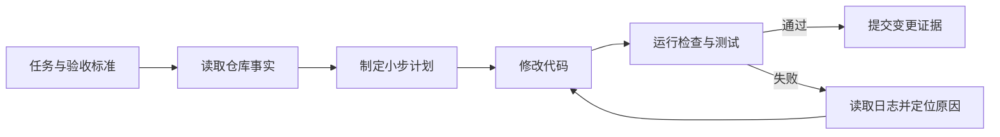

最近一段时间，AI 编程工具的讨论经常围绕一个问题展开：**模型到底能不能把代码写对？**

这个问题当然重要，但它很容易把注意力带到一个过于狭窄的地方。真实的软件工程从来不只是生成几段函数，还包括理解仓库、遵守架构、运行测试、观察线上行为、处理失败，以及在需求变化后继续维护。

如果把模型单独放在聊天窗口里，它只能根据当下看到的上下文给出一个看起来合理的答案。要让它在真实项目里持续完成任务，还需要一整套围绕模型搭建的工具、规则、状态和反馈机制。这套系统，正在被越来越多人称为 **Harness Engineering**。

本文不把它翻译成某个神秘的新框架，而是把它理解成一个工程问题：

> **如何为 AI 智能体设计一个可观察、可约束、可验证、可恢复的工作环境？**

## 一、先区分三个容易混淆的概念

### Prompt Engineering：怎么说得更清楚

Prompt Engineering 关注的是一次交互里的表达方式：背景是什么、目标是什么、输出格式是什么、有哪些限制条件。

它解决的是“**这一轮怎样让模型理解我的意图**”。例如：

```text
请为用户注册接口补充参数校验。
要求：
1. 保持现有 API 返回结构不变
2. 为异常输入增加测试
3. 完成后运行项目测试
```

### Context Engineering：给模型看什么

Context Engineering 关注的是模型在这一轮任务里实际能够看到的内容：相关源文件、数据库结构、历史决策、命令输出、错误日志和最近的改动。

上下文太少，智能体会凭经验猜；上下文太多，重要信息会被淹没。好的上下文不是把整个仓库一股脑塞给模型，而是让它在正确的时间读到正确的事实。

### Harness Engineering：让它如何工作

Harness Engineering 再向外一层，关心的是智能体完成任务的整个运行环境：

- 它能使用哪些工具？
- 哪些目录和服务可以访问？
- 什么结果算完成？
- 失败之后如何定位和恢复？
- 谁来批准高风险操作？
- 如何留下可复盘的证据？

可以用一个简单的公式表示：

```text
可靠的智能体 = 模型能力 × 工作环境 × 反馈质量
```

模型能力再强，如果没有测试、日志和边界，它依然可能在错误方向上高速前进。

## 二、Harness 的核心不是“限制模型”，而是暴露真实反馈

很多人第一次搭建智能体时，会从一条很长的系统提示词开始：告诉它项目背景、编码规范、目录结构和注意事项。

文档有用，但文档本身不是约束。只写“请保持模块边界清晰”，并不能阻止一段跨层依赖进入代码库；只写“请记得运行测试”，也不能保证测试真的覆盖了这次修改。

更可靠的方式是把要求变成智能体可以执行和验证的接口：

| 人的要求 | 可执行的 Harness |
| --- | --- |
| 遵守格式 | formatter 与 lint 检查 |
| 不破坏类型 | typecheck |
| 不改变已有行为 | 回归测试 |
| 不越过模块边界 | 依赖规则或架构检查 |
| 页面确实可用 | 浏览器冒烟测试与截图 |
| 线上没有明显异常 | 日志、指标与错误追踪 |

这背后的变化是：智能体不再只听人描述“应该怎样”，而是能直接看到“现在发生了什么”，并通过工具验证“改完之后是否真的变好了”。

## 三、一个最小可用的智能体工作回路

Harness 不必一开始就做成复杂平台。对一个个人项目来说，下面这条回路已经足以带来明显改善：



这里有三个关键点。

### 1. 先定义“完成”，再开始写代码

“把项目做得更好”不是一个可验证的任务。“项目页展示所有公开仓库、卡片显示语言和星标、构建成功”就清楚得多。

验收标准越具体，智能体越容易自己判断下一步；人也越容易在最后只检查结果，而不是重新阅读每一行实现。

### 2. 让失败信息回到同一条回路里

命令失败并不等于任务失败。对智能体来说，失败的测试、类型错误和浏览器控制台日志都是下一轮决策的输入。

如果工具只返回一句“失败了”，模型只能重新猜测；如果工具返回具体的堆栈、文件、行号和复现步骤，模型才有机会进行有针对性的修复。

### 3. 每一轮都留下证据

一次成功的构建、一个通过的测试、一个复现并修复的 Bug，都是比“我觉得应该没问题”更可靠的交付证据。

## 四、把 Harness 放进代码仓库

对于个人博客或小型应用，最有价值的 Harness 往往不是新建一个巨大的 Agent 平台，而是把项目的隐含知识显式化。

我会优先放入下面几类文件：

### `AGENTS.md`：让协作者快速建立正确上下文

它可以说明：

- 项目的目录结构和技术栈
- 哪些命令用于开发、构建和检查
- 内容或数据应该放在哪一层
- 哪些文件不应该被自动改动
- 完成任务前必须提供什么验证结果

它不应该变成一篇没人维护的百科全书。每当智能体因为缺少某条规则反复犯错，就把这条规则补进仓库；如果某条规则已经由自动检查保证，就不必在文档里重复堆叠。

### `scripts/`：把重复动作变成工具

例如：检查 Markdown frontmatter、验证链接、生成内容索引、启动本地预览，或者对关键页面做截图。

脚本的价值不只是节省几个命令，而是统一了“检查应该怎么做”。智能体调用同一个脚本，得到的反馈比每次临时拼接命令更稳定。

### `tests/`：把产品行为写成可执行的语言

单元测试适合验证局部逻辑，端到端测试适合验证用户真正走过的路径。两者都不需要覆盖一切，但要覆盖最容易回归、最能代表产品价值的部分。

对于博客，最小集合可以是：文章列表能打开、文章详情能打开、语言切换不产生 404、生产构建能够完成。

## 五、架构约束应该写“不变量”，而不是写死每个实现

智能体需要边界，但边界不等于事无巨细地规定每一行代码。

一个好的约束描述的是**不变量**：

- 内容必须通过 frontmatter 校验
- 页面只能从数据层读取项目列表
- 文章链接必须指向已生成的路由
- 生产构建不能依赖一个不可用的本地文件

至于具体使用哪个小工具、怎样拆分一个函数，可以留给实现者。这样既能守住架构，又不会把智能体变成只会照抄模板的代码生成器。

这也是 Harness 与“给模型一份超长规范”之间的区别：规范告诉它应该怎样想，而 Harness 让错误的结果无法悄悄通过。

## 六、权限和恢复：自主程度越高，越要有明确边界

一个能够修改代码的智能体，和一个能够直接推送生产、删除数据、发送邮件的智能体，风险完全不同。

因此，权限最好按任务分层：

```text
读取仓库 → 修改工作区 → 运行验证 → 创建提交 → 推送远端 → 发布生产
```

前几步可以高度自动化，涉及远端写入、数据删除或生产发布的步骤则应保留明确的批准点。这个批准点不是对智能体能力的不信任，而是对不可逆操作的正常工程控制。

恢复机制也同样重要。智能体可能遇到依赖安装失败、测试环境不可用或需求描述歧义。一个可用的 Harness 至少要让它能够：

1. 记录失败发生在哪一步
2. 保留失败前的变更上下文
3. 重试不会重复产生危险副作用
4. 在无法继续时清楚地报告阻塞原因

## 七、如何判断 Harness 是否真的变好了？

不要只看模型写了多少行代码，更应该观察整个交付回路：

- 从任务开始到得到可验证结果需要多久
- 第一次实现通过检查的比例是多少
- 同一类错误是否在减少
- 人需要介入多少次
- 失败后能否快速定位和恢复
- 变更是否带来了更多回归问题

如果某个新工具让智能体输出更多内容，却让人花更多时间清理，Harness 并没有变好；如果增加了一个很小的检查，却减少了大量重复返工，它就是有效的工程投资。

## 八、我的实践结论

Harness Engineering 最值得借鉴的地方，并不是“让 AI 全自动写完所有代码”，而是重新安排了人的工作位置。

人更应该负责：

- 定义问题和优先级
- 设计系统边界
- 把质量要求转成验收标准
- 选择哪些反馈必须自动化
- 在高风险节点做判断

智能体更适合负责：

- 在清晰边界内执行重复性工作
- 读取日志、搜索代码和尝试局部修复
- 运行检查并整理结果
- 维护文档、脚本和测试这些“工程基础设施”

OpenAI 在 2026 年关于 Harness Engineering 的实践文章里，把这种变化概括为：工程团队的重点从直接编写代码，转向设计环境、表达意图，以及建立让智能体可靠工作的反馈回路。这个观点对个人开发者同样成立，规模不同，原理并没有改变：**把隐含经验变成可读取的上下文，把口头要求变成可执行的检查，把失败变成下一轮可利用的信号。**

如果 Prompt Engineering 是把话说清楚，Context Engineering 是把资料准备好，那么 Harness Engineering 就是在搭建一条能够持续交付的轨道。

真正成熟的 AI 编程，不是让模型看起来像一个更快的实习生，而是让整个仓库变成一个更适合协作、更容易验证、更能够自我暴露问题的工程系统。

## 参考阅读

- [Harness engineering: leveraging Codex in an agent-first world](https://openai.com/index/harness-engineering/) —— OpenAI，2026-02-11
