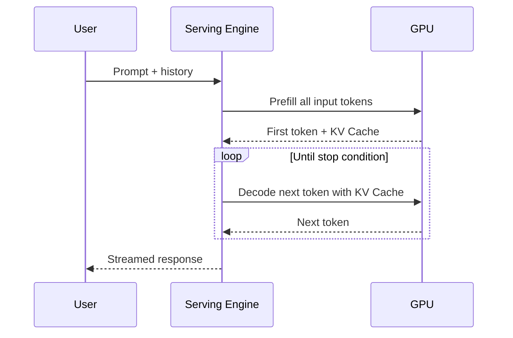
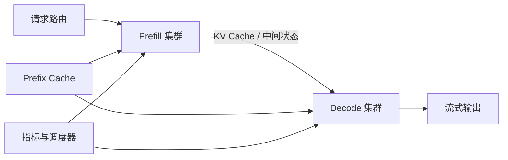

当一个大语言模型只服务一个请求时，推理看起来很简单：输入 Prompt，模型逐个生成 Token，返回答案。

但当模型真正进入生产环境，问题马上变成了系统问题：几十个请求同时到达怎么办？长上下文会不会把显存吃光？为什么 GPU 利用率看起来很高，用户却还在等待？为什么相同的系统提示词每次都要重复计算？

今天的 LLM 推理服务，核心已经不只是“把模型加载起来”，而是围绕三种资源做调度：**计算、显存和等待时间**。

> **模型决定能生成什么，推理系统决定这些能力能否以可接受的成本被使用。**

## 一、一次生成其实包含两个阶段

### Prefill：先处理整段输入

Prefill 阶段会读取用户的 Prompt、历史对话、工具结果和检索内容，一次性计算输入序列的表示。

它通常更偏计算密集型，输入越长，第一次响应前需要处理的内容越多。用户感受到的一个重要指标就是 **TTFT（Time to First Token）**：从请求到第一个 Token 出现需要多久。

### Decode：再逐个生成输出

Decode 阶段每次通常只生成一个新 Token，但要反复读取此前 Token 的注意力状态。它更容易受显存带宽、KV Cache 容量和并发调度影响。

可以把一次请求画成这样：



Prefill 决定“多久开始说话”，Decode 决定“说话过程中有多快”。如果只看平均吞吐，很容易掩盖某一类请求的延迟问题。

## 二、KV Cache 是什么？为什么它会成为瓶颈？

Transformer 在生成新 Token 时，需要使用此前 Token 的 Key 和 Value。如果每一步都重新计算历史内容，生成速度会非常慢。

KV Cache 的做法是把已经计算过的 Key/Value 保存下来，下一步直接复用。它避免了重复计算，却把压力转移到了显存：序列越长、并发越高，缓存越大。

一个用于建立直觉的近似公式是：

```text
KV Cache ≈ 2 × 层数 × KV 头数 × 每头维度 × Token 数 × 每元素字节数
```

实际占用还会受到批大小、数据类型、分组查询注意力、缓存布局和框架实现影响，但这个公式揭示了最重要的关系：**上下文长度和并发数会直接放大显存需求。**

如果服务端为每个请求预留一整块连续的最大上下文空间，就会产生严重的碎片和浪费：短请求占用大空间，长请求又可能因为找不到连续空间而无法调度。

## 三、PagedAttention：把 KV Cache 当成操作系统内存来管理

PagedAttention 的核心思路是把每个请求的 KV Cache 切成固定大小的 Block，再通过映射表把逻辑位置映射到物理显存块。

```text
请求 A 的逻辑 Cache: [0][1][2][3]
物理显存 Block:       [7][2][9][4]

请求 B 的逻辑 Cache: [0][1]
物理显存 Block:       [8][1]
```

这样做的好处是：

- 不必为每个请求预留连续的大块显存
- 请求结束后可以回收独立 Block
- 新 Token 只需要申请新的 Block
- 相同前缀可以共享物理 Block

这和虚拟内存的思想很像。vLLM 将 PagedAttention 与连续批处理、Prefix Caching、量化和推测解码组合成了一套完整的推理服务能力。

需要注意的是，PagedAttention 不是一个“让模型更聪明”的算法，它是一个服务系统优化。它减少内存浪费、改善并发调度，但最终收益仍然取决于模型结构、请求分布和硬件。

## 四、Continuous Batching：不要等整批请求一起结束

传统静态批处理通常要等待一批请求都准备好，然后一起执行。这在输入长度和输出长度差异很大时会产生浪费：短请求早就结束了，却要跟着最长请求一起占用批次位置。

连续批处理会在每个 Decode 步重新调整批次：

```text
时间 1：请求 A、B、C
时间 2：A 完成，加入请求 D → B、C、D
时间 3：C 完成，加入请求 E → B、D、E
```

它把调度单位从“一整批请求”推进到“每个生成步骤”，让 GPU 更容易持续有活可做。

但连续批处理也带来了调度难题：长 Prefill 可能阻塞正在 Decode 的请求，短请求可能被长请求拖慢，不同优先级请求需要不同的服务策略。

## 五、Prefix Caching：相同的 Prompt 不要重复计算

很多生产请求会共享前缀：

- 相同的系统提示词
- 相同的工具定义
- 相同的文档模板
- 相同的长文档开头

如果每个请求都重新做一遍 Prefill，计算会被重复浪费。Prefix Caching 会根据 Token 前缀和缓存 Block 建立复用关系：命中时直接复用已经计算过的 KV Cache，只处理新增内容。

```text
共享前缀：System Prompt + Tool Schema + 文档目录
          └───────────────┬───────────────┘
请求 A：                  + 用户问题 A
请求 B：                  + 用户问题 B
```

缓存命中率不是越高越好就结束了，还需要考虑：缓存内容是否会泄露用户数据、缓存失效如何处理、不同租户是否隔离、缓存占用是否挤压了正在生成的请求。

## 六、Prefill / Decode 解耦：让两类负载分别扩展

Prefill 和 Decode 的硬件需求不同：

| 阶段 | 主要特点 | 常见关注点 |
| --- | --- | --- |
| Prefill | 输入长、并行度高、偏计算密集 | TTFT、输入吞吐、Chunked Prefill |
| Decode | 单步生成、反复读缓存、偏带宽密集 | TPOT、KV Cache、并发公平性 |

当工作负载差异足够明显时，可以把两者拆到不同的实例或 GPU 池中：Prefill 节点处理输入，Decode 节点负责持续生成，中间传递 KV Cache 或相关中间状态。



解耦带来更好的资源利用率，但也增加了网络传输、状态一致性和故障恢复成本。它不是所有部署都需要的默认架构，只有当输入长度、输出长度和并发模式确实分化时才值得引入。

## 七、量化和推测解码解决的是不同问题

### 量化：减少每个参数和缓存元素的成本

FP16、BF16、FP8、INT8、INT4 等数据类型会在精度、显存和速度之间做不同取舍。量化不仅影响模型权重，也可能影响 KV Cache。

最重要的不是盲目追求更低比特，而是针对自己的任务验证：

- 生成质量下降是否可接受
- 长上下文是否更容易出错
- 解码速度是否真的提升
- 硬件是否有对应的高效 Kernel

### 推测解码：减少生成步骤的等待

推测解码使用一个更快的小模型先提出多个 Token，再由目标模型一次验证。验证通过的部分可以批量接受，失败处再回退到目标模型。

```text
小模型：提出 [A, B, C, D]
大模型：验证 [A, B, C]，拒绝 D
结果：一次接受前三个，再从 D 的位置继续
```

它的收益取决于小模型和大模型的预测一致性。如果草稿模型经常猜错，额外的验证反而会增加开销。量化主要降低存储与计算成本，推测解码主要减少有效生成步数，两者可以组合，但不是同一个优化方向。

## 八、不要只看 Tokens per Second

一个推理服务是否好用，需要至少同时观察这些指标：

- **TTFT**：首 Token 延迟，反映 Prefill 和排队
- **TPOT**：生成 Token 之间的平均间隔，反映 Decode 体验
- **吞吐**：每秒生成 Token 或完成请求数
- **并发公平性**：长请求是否让短请求长时间等待
- **KV Cache 命中率**：Prefix Caching 是否有效
- **显存水位**：是否频繁驱逐缓存或触发 OOM
- **有效吞吐**：只有通过质量与安全检查的输出才算有效产出

比如，一个配置可能让平均吞吐上升，却让 P99 TTFT 恶化；另一个配置可能降低原始 Token 吞吐，却因为缓存命中率更高而显著降低真实成本。

因此，压测必须使用接近真实的请求分布，而不是只拿一个固定 Prompt 反复请求。

## 九、一个实用的压测矩阵

可以从四个变量开始构造测试：

```text
输入长度：短 / 中 / 长
输出长度：短 / 中 / 长
并发数：  1 / 8 / 32 / 128
缓存情况：冷缓存 / 热缓存
```

每个组合至少记录：TTFT、TPOT、总延迟、吞吐、显存峰值和错误率。

如果还要比较 Prefix Caching、量化或 Prefill/Decode 解耦，就应固定模型、采样参数和请求集合，只改变一个系统变量。否则得出的结论很难复现。

## 十、从一个模型服务到一套推理系统

一个最小的生产架构通常包含：

1. 请求网关：鉴权、限流、租户隔离和请求排队
2. 调度器：决定请求进入哪个实例、哪个批次
3. 推理引擎：管理模型执行、KV Cache 和流式输出
4. 缓存层：复用共享前缀，控制失效和隔离
5. 观测层：记录延迟、吞吐、显存和错误
6. 评测层：确认优化没有破坏回答质量

这也是为什么 LLM Serving 越来越像数据库和操作系统的结合体：它既要管理状态，又要调度资源，还要在每次优化后证明行为没有被改变。

## 十一、常见误区

### 误区 1：显存够，就可以把上下文上限拉满

上下文上限提高会放大单请求的 KV Cache 占用，也可能降低并发和缓存命中。应该根据真实请求分布设置上限，而不是只看模型宣传的最大窗口。

### 误区 2：批越大，吞吐一定越高

批次过大可能让长请求挤占短请求，增加排队和 P99 延迟；也可能让 KV Cache 达到临界点，导致频繁驱逐。

### 误区 3：所有优化都可以叠加

量化、Prefix Caching、Chunked Prefill、推测解码和分离式服务之间可能存在 Kernel、显存、网络或质量上的耦合。每加入一种优化，都需要重新压测。

### 误区 4：只看服务端日志，不看用户体验

服务端平均耗时很漂亮，不代表用户能及时看到第一个 Token。流式输出的 TTFT、TPOT 和中断率通常比单纯的总耗时更接近真实体验。

## 结语：推理优化的终点不是更快，而是更合适

LLM 推理服务正在从“把模型放进 GPU”进入“围绕状态、内存和调度构建系统”的阶段。

PagedAttention 解决缓存的空间管理，连续批处理改善请求调度，Prefix Caching 减少重复 Prefill，Prefill/Decode 解耦让不同负载能够分别扩展，量化和推测解码则从不同角度降低计算成本。

但这些技术没有一个可以脱离工作负载单独评价。真正的优化顺序应该是：先测量瓶颈，再选择机制，最后用质量、延迟、吞吐和成本共同验证。

如果只记住一句话，可以记住这句：

> **LLM Serving 的核心不是让 GPU 忙起来，而是让每一份计算、每一块显存和每一次等待都服务于真实的用户请求。**

## 参考阅读

- [vLLM Documentation](https://docs.vllm.ai/en/v0.21.0/) —— PagedAttention、连续批处理、Prefix Caching、量化与推测解码
- [Efficient Memory Management for Large Language Model Serving with PagedAttention](https://arxiv.org/abs/2309.06180) —— PagedAttention 原始论文
- [PagedAttention · Hugging Face Text Generation Inference](https://huggingface.co/docs/text-generation-inference/main/conceptual/paged_attention) —— KV Cache 分块管理说明
- [Multi-Segment Attention](https://arxiv.org/abs/2606.02964) —— 面向 KV Cache 管理的近期研究方向
