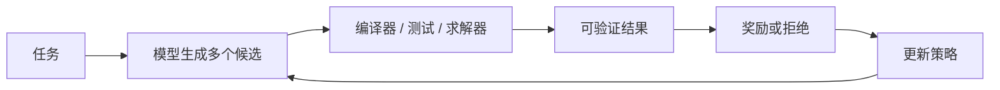
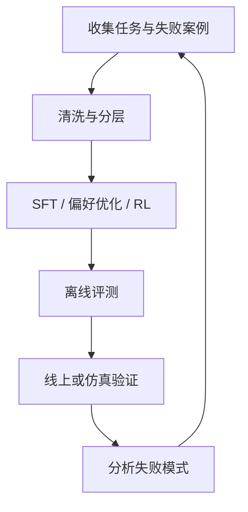

如果把预训练看成让模型读完一座巨大的图书馆，那么后训练做的事情就是教它如何成为一个真正可用的助手：听懂任务、遵守格式、选择合适的解题路径，并在不确定时诚实地表达边界。

过去谈到大语言模型，大家更容易关注参数量、训练数据和基准分数。到了今天，模型之间的差异越来越多地体现在另一个阶段：**模型拿到基础能力之后，怎样被训练成“更会做事”的系统。**

这就是 LLM 后训练（Post-Training）变得重要的原因。

> **预训练决定模型知道什么，后训练决定模型如何使用这些知识。**

本文不试图罗列所有算法，而是从工程视角梳理一条更实用的主线：监督微调、偏好优化、可验证奖励、推理预算和评测闸门如何组合起来，最终形成一个能持续迭代的小模型系统。

## 一、为什么“继续喂数据”不等于后训练？

预训练通常让模型学习下一个 Token 的分布。它擅长从海量文本中吸收语言规律、事实关联和代码模式，但它并不知道一个产品真正需要的行为边界：

- 用户要求 JSON 时不能顺手输出一大段解释
- 代码任务不能只生成看起来漂亮的实现，还要通过测试
- 数学题不能因为答案形式像样就忽略中间的逻辑错误
- 不知道答案时，应该降低自信，而不是补一个听起来合理的细节

后训练的目标，是把这些“应该怎样行动”的要求变成训练信号。

一个简化的后训练数据可以长这样：

```json
{
  "prompt": "实现一个带过期时间的缓存",
  "response": "...模型生成的代码...",
  "signals": {
    "format": 1,
    "tests": 1,
    "security": 0,
    "human_preference": 0.8
  }
}
```

重点不在于把所有信号压成一个漂亮的分数，而在于明确：**什么行为值得强化，什么错误必须在评测中被看见。**

## 二、后训练的三层结构

### 1. SFT：先教模型遵守任务格式

监督微调（Supervised Fine-Tuning）使用高质量的“输入—输出”样本，让模型学会基本的任务形式：

- 如何理解指令
- 如何使用工具
- 如何输出结构化结果
- 如何进行多轮对话
- 如何按照项目约定修改代码

SFT 的优点是直接、稳定、容易调试。缺点也很明显：它只能模仿数据里的答案，不能自动知道某个答案在真实环境里是否有效。

对代码模型来说，一段能通过语法检查的代码，和一段真正修复了 Bug 的代码，中间隔着很长的距离。

### 2. 偏好优化：让模型在候选答案之间做选择

偏好数据通常会给出两个或多个候选回答，再标记哪个更好：

```text
问题：如何处理用户上传的文件？

候选 A：直接把文件名拼接进系统路径。
候选 B：校验文件类型，生成服务端文件名，并将路径限制在目标目录内。

偏好：B
原因：B 同时考虑了路径穿越和文件类型风险。
```

这类训练让模型逐渐学会“什么答案更符合要求”。DPO 等方法的价值在于工程实现相对简单，不一定需要完整地训练一个奖励模型。

但偏好仍可能停留在表面：人会偏好写得流畅的解释，代码却可能根本跑不起来。要处理这类问题，就需要把结果交给可执行的验证器。

### 3. RL with Verifiable Rewards：让结果接受真实世界检查

对于数学、代码、数据处理等任务，很多结果可以由外部程序验证：

- 编译器能否通过
- 单元测试是否通过
- 数学表达式是否等价
- JSON 是否符合 Schema
- 模拟器中的约束是否满足

这类信号被称为可验证奖励（Verifiable Rewards）。它的关键变化是：模型不再只学习“看起来像正确答案”，而是通过执行结果获得反馈。



当然，验证器也可能被钻空子。测试覆盖不足时，模型可以生成“只为当前测试服务”的代码；奖励规则过于单一时，模型可能优化分数而不是优化真正目标。

所以，可验证奖励不是“有测试就万事大吉”，而是要求验证器足够接近产品目标，并且不断增加对真实失败模式的覆盖。

## 三、推理模型为什么需要“思考预算”？

近年的推理模型把更多计算放到了生成阶段：模型会先产生中间推理，再给出答案。复杂任务因此可能得到更好的结果，但代价是更高的延迟、Token 消耗和服务成本。

Qwen3 的技术报告展示了一种很有代表性的方向：同一个模型可以在 thinking 与 non-thinking 模式之间切换，并通过思考预算在质量和速度之间做选择。

这揭示了一个重要事实：**推理能力不是越多越好，而是要把计算花在值得花的任务上。**

一个简单的路由策略可以是：

```python
def choose_mode(task):
    if task.requires_math_proof or task.requires_code_execution:
        return {"mode": "thinking", "budget": 4096}

    if task.is_simple_lookup or task.requires_low_latency:
        return {"mode": "non-thinking", "budget": 0}

    return {"mode": "thinking", "budget": 1024}
```

这段代码不是模型训练方法，而是产品层面的推理调度。后训练要做的是让模型在这些模式下都保持稳定：快速回答不能变成草率回答，长思考也不能变成无休止的自我检查。

## 四、模型会“过度思考”吗？

会。

当模型被奖励“多检查、多推导、多尝试”时，它可能把更长的推理过程误认为更高质量。Google DeepMind 在 2026 年 7 月发布的研究中，专门分析了推理模型的 overthinking，指出模型可能在简单问题上继续探索或反复验证，却没有得到对应的准确率收益。

这使后训练出现了一个新的目标：不仅要训练模型“想得出来”，还要训练它“知道什么时候够了”。

可以从三个方向处理：

1. **把正确率和推理长度一起评测**：不能只看 Pass@1，也要看为得到这个结果消耗了多少 Token。
2. **加入难度感知的预算**：简单任务用短预算，困难任务允许更多探索。
3. **惩罚无效推理**：如果额外的思考没有提升结果，就不应该无条件给予更多奖励。

“会思考”与“会合理分配思考”是两种不同能力，后者会越来越成为实际产品的分水岭。

## 五、从结果奖励到过程奖励

只在最后判断“对不对”，叫结果奖励（Outcome Reward）。它的反馈清楚，但比较稀疏：一百步的推理最后错了，模型只知道整条轨迹没有拿到奖励，却不一定知道错在第几步。

过程奖励（Process Reward）试图对中间步骤进行评价：

```text
步骤 1：识别题目中的已知条件        ✓
步骤 2：选择定理或工具              ✓
步骤 3：把单位从米转换成厘米          ✗
步骤 4：继续基于错误单位计算           ✗
```

过程奖励能提供更密集的学习信号，但它也会带来新的风险：一个错误步骤可能因为表达得很流畅而获得高分，或者奖励模型学会偏爱某种表面格式。

因此，较稳妥的做法是让结果奖励作为最终约束，过程奖励作为辅助信号。过程检查帮助模型少走弯路，但不能推翻真实执行结果。

## 六、后训练真正难的是数据闭环

一条可持续的后训练流水线通常不是“准备数据—训练—看分数”这么简单，而是一个循环：



其中最有价值的数据，往往不是随机抓取的更多样本，而是能代表真实失败的样本：

- 模型格式正确但业务逻辑错
- 测试通过但边界条件没覆盖
- 简单任务浪费大量推理 Token
- 工具调用参数合法但顺序不对
- 面对不完整信息时编造结论

失败样本需要被分类。否则下一轮训练很容易只是在总体分数上做优化，却没有解决真正影响用户的那一类问题。

## 七、评测不应该只是一张排行榜

一个适合工程发布的评测集，至少应该同时关注四个维度：

| 维度 | 需要回答的问题 |
| --- | --- |
| 能力 | 模型能不能完成目标任务？ |
| 稳定性 | 换输入、换顺序、换长度后是否仍然有效？ |
| 成本 | 完成任务消耗了多少 Token、时间和显存？ |
| 安全 | 是否会越权、泄露信息或绕过约束？ |

还要区分离线评测和线上评测。离线集适合快速比较实验，线上或仿真环境则能暴露工具调用、状态管理和长链路任务中的问题。

一个简单的发布闸门可以这样定义：

```text
允许发布 = 核心任务通过率达标
        AND 回归集没有下降
        AND 平均推理成本不超过预算
        AND 安全检查没有新增高风险项
```

分数变高但成本翻倍，不一定是升级；某个 benchmark 变好但代码任务回归，也不应该直接发布。

## 八、小模型并不只是“大模型的缩水版”

后训练让小模型有机会在特定任务上获得很强的实用能力。常见路线包括：

- 用更强模型生成高质量示例
- 通过蒸馏把推理轨迹压缩到小模型
- 只训练与目标任务相关的适配层
- 用真实执行器提供奖励
- 在小而难的评测集上反复修正

这并不意味着“小模型一定可以替代大模型”。更准确的说法是：如果任务边界清楚、验证器可靠、数据闭环稳定，小模型可以用更低成本完成一部分高价值工作。

这也是后训练工程化的意义：把模型能力从一张通用成绩单，变成一个有边界、有成本、有证据的产品能力。

## 九、实践时最容易忽略的三件事

### 1. 训练目标和产品目标没有对齐

训练时奖励格式完整，线上却需要事实准确；训练时奖励测试通过，线上却需要性能稳定。指标如果没有对齐，模型只会忠实地优化错误方向。

### 2. 只保存最终模型，不保存实验上下文

后训练实验需要记录数据版本、采样策略、超参数、评测结果和失败案例。否则当分数变化时，你无法判断到底是数据、算法还是评测环境造成的。

### 3. 只评测“最好的回答”，不评测“最坏的回答”

生成模型具有随机性。除了平均准确率，还应该观察多次采样中的失败类型、最差延迟和最差安全表现。一个偶尔给出危险结果的模型，不能因为平均分高就直接上线。

## 结语：后训练是把能力变成行为的过程

LLM 的竞争正在从“谁拥有更大的预训练模型”，逐渐扩展到“谁能更稳定地把模型训练成一个可用系统”。

SFT 让模型学会遵守任务形式，偏好优化让它更接近人类期望，可验证奖励让它接受真实执行结果，推理预算让它学会分配计算，评测闸门则决定哪些能力可以被真正发布。

最值得投入的地方，往往不是再堆一层更复杂的训练技巧，而是把失败样本、验证器、成本指标和发布标准连接成闭环。

当模型学会推理之后，下一步不是让它永远想下去，而是让它知道：什么时候该继续，什么时候该求助，什么时候已经有足够证据停下来。

## 参考阅读

- [Qwen3 Technical Report](https://arxiv.org/abs/2505.09388) —— thinking / non-thinking 模式与推理预算
- [Towards Structural Understanding of LLM Overthinking](https://deepmind.google/research/publications/203490/) —— Google DeepMind，2026-07-02
- [Reinforcement Learning with Verifiable Physics](https://arxiv.org/abs/2607.10474) —— 可验证奖励从二值结果走向连续反馈的研究示例
- [DeepSeek-R1](https://github.com/deepseek-ai/DeepSeek-R1) —— 推理模型与强化学习实践
