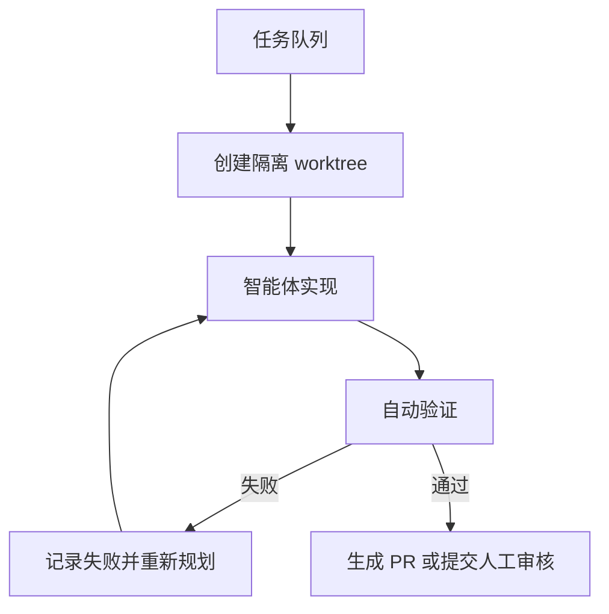

过去使用 AI 编程工具时，我们通常是这样工作的：写一条提示，等待结果，阅读代码，再写下一条提示。

这个方式对小任务很有效。修一个明显的 Bug、补一个函数、解释一段代码，都可以在几轮对话里完成。但当任务变成长时间工作时，真正限制效率的往往不再是模型会不会写代码，而是**谁来推动下一步**。

如果每一次“继续做什么”都必须由人手动输入，AI 仍然只是一个需要持续操作的工具。Loop Engineering 想解决的，正是这个问题：

> **不要只设计给智能体的一条提示，而要设计一个能持续发现、执行、验证和停止的工作循环。**

本文把 2026 年 6 月 7 日作为 Loop Engineering 进入集中讨论的时间锚点，参考了 Addy Osmani 当天发布的同名文章。这个日期代表公开讨论明显升温，并不意味着这个思想在此之前不存在。

## 一、Loop Engineering 到底在“工程”什么？

一个最小的智能体循环可以写成这样：

```text
while not done:
    context = gather(task, repository, history, last_result)
    action = agent(context)
    result = execute(action)
    state = record(result)
    done = verify(result, goal)
```

模型只负责提出下一步行动，真正决定可靠性的，是循环中的其他部分：

- `gather`：它拿到什么上下文
- `execute`：它能使用什么工具、产生什么副作用
- `record`：上一次做了什么，哪些事情已经完成
- `verify`：什么证据能证明目标已经达到
- `done`：什么时候必须停止，而不是继续消耗时间和 Token

所以，Loop Engineering 不是简单地把一个 Prompt 放进 `while` 循环，也不是让智能体无限运行。它是在设计一个**能够收敛的控制系统**。

## 二、它和 Prompt、Context、Harness 的关系

可以把这几个概念看成逐层外扩：

| 层次 | 主要问题 | 典型产物 |
| --- | --- | --- |
| Prompt Engineering | 这一轮应该怎么说 | 一条任务提示 |
| Context Engineering | 模型应该看到什么 | 代码、日志、文档、历史状态 |
| Harness Engineering | 智能体如何安全地工作 | 工具、权限、沙箱、测试、反馈 |
| Loop Engineering | 谁来推动下一轮，以及何时停止 | 调度器、状态、验证器、停止规则 |

Harness 更像智能体运行的“工作台”，Loop 更像让这张工作台持续运转的“生产流程”。两者不是互相替代的关系：没有好的 Harness，Loop 只会更快地重复错误；没有 Loop，Harness 往往只能服务一次手动运行。

## 三、一个真正可用的 Loop 需要哪些部件？

### 1. 清晰的目标和任务来源

循环不能只拥有“继续优化项目”这种模糊目标。它需要知道任务从哪里来，以及怎样判断任务值得处理：

- 未关闭的 Issue
- 最近失败的 CI
- 用户反馈
- 监控告警
- 待完成的产品清单
- 定期生成的维护任务

任务来源决定循环观察什么。一个每天检查依赖漏洞的循环，和一个每周整理文档链接的循环，应该有不同的输入和权限。

### 2. 明确的执行者和工作边界

循环可以只调用一个主智能体，也可以拆成多个角色：

```text
探索者：确认问题、查找相关代码、提出计划
实现者：在隔离工作区内修改代码
验证者：根据目标和测试检查结果
汇总者：记录状态，决定下一步或提交人工审核
```

拆分的价值不在于“智能体越多越先进”，而在于让提出方案的人和检查方案的人拥有不同的职责。实现者说“已经完成”不能直接等同于完成，验证者必须看到实际证据。

### 3. 可持续的状态

对话不是可靠的长期记忆。上下文会被压缩，运行会被中断，模型也可能忘记前几轮已经尝试过什么。

因此，Loop 需要把关键状态写到对话之外，例如 Markdown 文件、Issue、数据库或任务看板：

```yaml
task: "修复文章路由的 404"
status: "verification"
attempts: 2
changed_files:
  - src/pages/blog/[...slug].astro
checks:
  - "npm run build: passed"
next_action: "打开生成的静态页面确认链接"
```

状态不应该只是运行日志的堆积，而应该回答三个问题：已经做了什么、证据是什么、下一步是什么。

### 4. 真实而快速的验证器

验证器是 Loop 的方向感。没有验证器，智能体只是在循环地产生文本和修改；有了验证器，它才知道哪些行动让系统更接近目标。

不同任务需要不同验证：

- 代码逻辑：单元测试、类型检查、Lint
- 页面体验：浏览器测试、链接检查、截图
- 数据处理：样本校验、统计结果、重复运行对比
- 线上修复：复现脚本、日志、指标和回归测试

验证器越接近真实目标，循环越不容易被“看起来成功”的假象欺骗。让测试变绿不是最终目标，最终目标是用户需要的行为确实成立。

### 5. 停止规则和人工闸门

一个没有停止规则的 Loop，会把“还可以再优化”误认为“还没有完成”。至少应该明确：

- 哪些条件满足后立即停止
- 最多允许尝试几次
- Token、时间或成本上限是多少
- 哪些动作必须交给人批准
- 验证失败后是重试、换策略，还是结束并报告

自动化程度越高，停止条件越不能含糊。**“直到满意为止”不是停止规则。**

## 四、为什么隔离工作区很重要？

当只有一个智能体时，直接修改当前工作区似乎没问题。可一旦循环并行处理多个任务，文件冲突就会迅速变成新的瓶颈。

Git worktree 或类似的隔离机制，可以让每个任务拥有独立目录和分支：



隔离解决的是“不同任务互相踩文件”的问题，但它不能替代审查。每个工作区都可以干净地完成，合并后仍然可能产生接口冲突、行为回归或不符合产品目标的实现。

## 五、从个人博客开始设计一个小 Loop

Loop Engineering 不一定要从复杂的多智能体平台开始。以一个 Astro 博客为例，可以先设计一个范围很小的维护循环：

1. 每天读取构建日志和未关闭 Issue
2. 只挑选能够自动验证的维护任务
3. 为每个任务创建独立工作区
4. 让智能体先复现，再修改
5. 运行 `npm run build` 和链接检查
6. 把修改文件、检查结果和未解决问题写入状态文件
7. 通过后创建待审核变更，失败则停止并报告

这个 Loop 已经比“每天打开项目，问 AI 今天该做什么”更稳定，因为任务来源、执行范围、验证方式和交付节点都被写清楚了。

## 六、常见的失败模式

### 1. 循环很长，但没有更好的信息

如果每次迭代看到的都是相同的上下文，智能体大概率只会重复相同的尝试。每一轮都应该新增有价值的反馈：新的错误、测试结果、用户观察或代码状态。

### 2. 验证器和实现者目标不一致

实现者让测试通过了，但测试并没有验证用户真正关心的行为。这时循环会非常“高效”地完成错误目标。

### 3. 状态只记录“做过什么”，不记录“为什么失败”

如果状态文件只写“尝试修复，未完成”，下一次运行还会重新走进同一个坑。失败原因、排除过的方案和仍然缺少的证据，同样应该被保存。

### 4. 自动化没有成本意识

每轮都启动多个大模型、重复读取大量文件、运行昂贵的测试，最后可能只是为了修一个低价值问题。调度频率、模型选择和并行度都应该和任务价值匹配。

### 5. 把“无人值守”误解成“无人负责”

循环可以代替人推动步骤，但不能代替人承担产品判断。尤其是涉及数据删除、生产发布、权限变更或外部沟通时，必须保留清晰的人工批准点。

## 七、如何判断一个 Loop 设计得好不好？

可以用下面几个问题做快速检查：

- 它是否能自动获得真实任务，而不是凭空生成工作？
- 每次行动后是否都有新的、可信的反馈？
- 验证器是否检查了用户真正关心的结果？
- 失败后是否会改变策略，而不是机械重试？
- 状态是否能让下一次运行从正确的位置继续？
- 是否明确知道什么时候停止？
- 重要副作用之前是否有人工闸门？

评价 Loop 时，也不要只看完成任务数量。更重要的指标包括：首次通过率、平均重试次数、人工介入次数、失败恢复时间、回归缺陷数量和每个任务的成本。

## 八、Loop Engineering 的边界

Loop Engineering 很容易被包装成“让 AI 自己干活”。但循环本身没有判断力，它只会按照我们提供的目标和反馈运行。

目标不清楚，Loop 会持续做无意义的工作；验证器不可信，Loop 会把错误当成成功；状态设计糟糕，Loop 会反复遗忘；权限过大，Loop 的错误就会变成真实的外部副作用。

所以，Loop Engineering 的核心不是把人从流程里删掉，而是把人的注意力提升到更高的层次：设计目标、选择反馈、控制风险、审查结果。人不必手动输入每一个“下一步”，但仍然要决定这条循环为什么存在、它可以触碰什么，以及什么证据足以让它停下来。

## 结语：真正的杠杆从“写提示”移动到了“设计循环”

Prompt 解决一次交互，Harness 解决一次运行，Loop 则解决一项工作如何持续推进。

当任务变得更长、更重复、更适合验证时，最有价值的动作可能不是再写一条更聪明的提示，而是补上一个任务来源、一个状态记录、一个验证器或一个停止条件。

Loop Engineering 并没有让软件工程消失。它只是把工程师的控制点从“亲自推动每一轮对话”，移动到了“设计一条能够安全收敛的工作循环”。

这也是我对这个新术语最实际的理解：**让智能体多做几步并不难，难的是让它每一步都能被看见、被验证，并且知道什么时候该停。**

## 参考阅读

- [Loop Engineering](https://addyosmani.com/blog/loop-engineering/) —— Addy Osmani，2026-06-07
- [Harness engineering: leveraging Codex in an agent-first world](https://openai.com/index/harness-engineering/) —— OpenAI，2026-02-11
